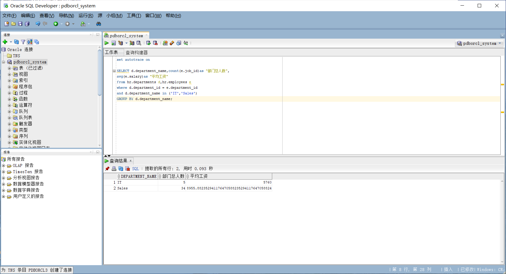
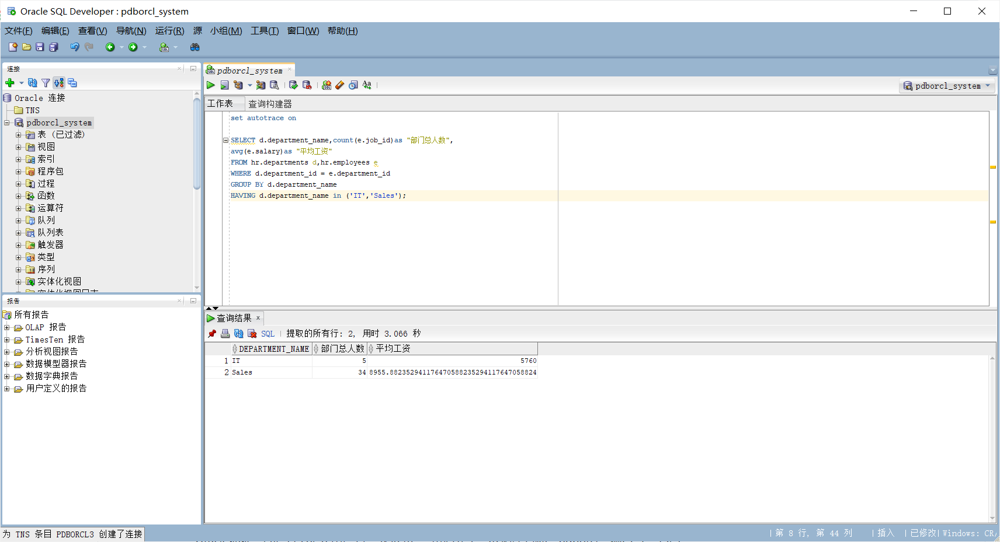
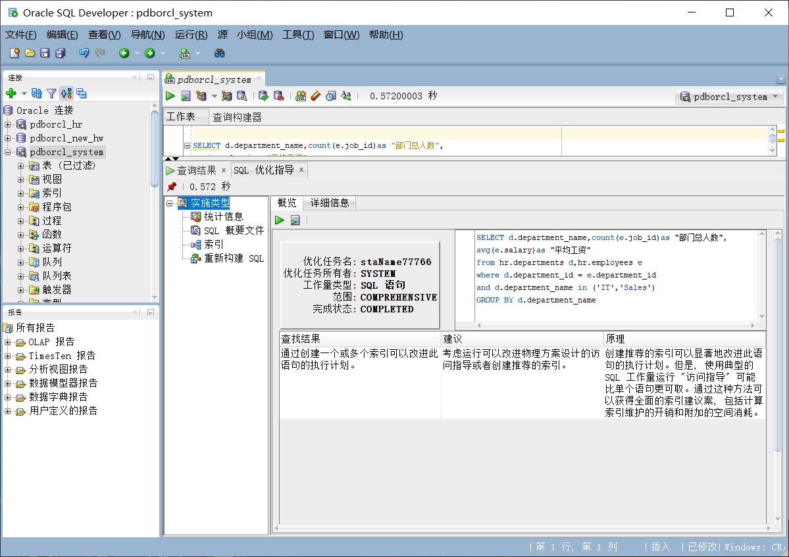

# 实验1：SQL语句的执行计划分析与优化指导

## 实验目的

分析SQL执行计划，执行SQL语句的优化指导。理解分析SQL语句的执行计划的重要作用。

## 实验内容

- 对Oracle12c中的HR人力资源管理系统中的表进行查询与分析。

- 首先运行和分析教材中的样例：本训练任务目的是查询两个部门('IT'和'Sales')的部门总人数和平均工资，以下两个查询的结果是一样的。但效率不相同。

- 设计自己的查询语句，并作相应的分析，查询语句不能太简单。

  查询1

  

  查询2

  

通过分析SQL语句各自的执行计划，查询1明显效率更高，为最优SQL语句。对查询1的SQL语句通过sqldeveloper的优化指导工具进行优化指导。

